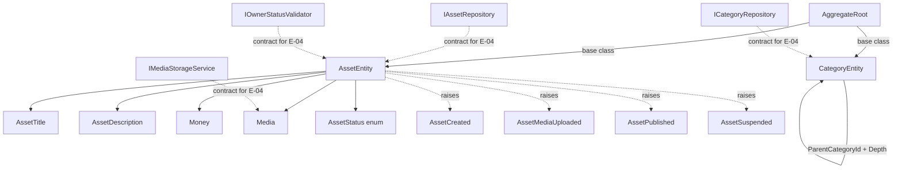

# E-02 · Domain Model & Core Asset Logic Design

**Spec**: `.specs/features/e02-domain-model/spec.md`
**Status**: Draft

---

## Architecture Overview

Pure Domain layer, zero framework/AWS dependencies. Two aggregates (`AssetEntity`, `CategoryEntity`), four value objects, a shared `AggregateRoot`/`IDomainEvent` base, four domain events, and four repository/service contracts. Nothing here touches DynamoDB, S3, or Kafka — those are Infrastructure (E-04) concerns; this layer only defines the shapes and contracts they implement against.



---

## Code Reuse Analysis

### Existing Components to Leverage

| Component | Location | How to Use |
|---|---|---|
| `ExampleEntity` | `02-src/03-Domain/.../Entities/ExampleEntity.cs` | Pattern reference only: private ctor + static `Create`, `ArgumentException.ThrowIfNullOrWhiteSpace` guards, `private set` properties. Not extended or referenced — it's the `Example*` scaffold slated for removal, per CLAUDE.md. |
| `ValidationConstants.cs` | `02-src/03-Domain/.../Constants/ValidationConstants.cs` | Add `AssetRules`/`CategoryRules` static classes here alongside existing `ExampleRules` (check current contents before editing — see Task 1) |
| `PagedResult.cs` | `02-src/03-Domain/.../Common/PagedResult.cs` | Reuse as-is for `IAssetRepository.SearchAsync` return type |

### Integration Points

| System | Integration Method |
|---|---|
| Application layer (E-03) | Consumes `IAssetRepository`/`ICategoryRepository`/`IMediaStorageService`/`IOwnerStatusValidator` via constructor injection in handlers — not built yet, contracts only |
| Infrastructure layer (E-04) | Implements the four interfaces above against DynamoDB/S3 — not built yet |
| Kafka outbox (E-04) | Reads `AggregateRoot.DomainEvents` after `SaveAsync`, publishes each — Domain only raises/collects, never publishes |

**Research note (Knowledge Verification Chain, step 1–2):** the plan doc says "Reuse `IEvent`/`IDomainEvent` interfaces (shared contract with identity-api pattern)" — checked this repo for a shared/`RentifyX.*` NuGet package reference (`Directory.Packages.props`) and found none. `identity-api` is a sibling repo, not available in this workspace, and no shared contracts package is referenced. **Decision:** define `IDomainEvent`/`AggregateRoot` locally in this Domain project, following the same naming/shape the plan implies (`RaiseDomainEvent`, `DomainEvents` read-only collection). If a shared package appears later, this can be swapped without changing call sites.

---

## Components

### AggregateRoot (base class)

- **Purpose**: Shared base for `AssetEntity`/`CategoryEntity` giving them a domain-event collection
- **Location**: `Domain/Common/AggregateRoot.cs`
- **Interfaces**:
  - `IReadOnlyCollection<IDomainEvent> DomainEvents { get; }` — read-only view
  - `protected void RaiseDomainEvent(IDomainEvent domainEvent)` — appends to internal list
  - `void ClearDomainEvents()` — called by Infrastructure after publish (E-04)
- **Dependencies**: none
- **Reuses**: nothing existing (new base type)

### IDomainEvent

- **Purpose**: Marker contract for all domain events
- **Location**: `Domain/Common/IDomainEvent.cs`
- **Interfaces**: `DateTime OccurredAt { get; }`
- **Dependencies**: none

### AssetEntity (aggregate root)

- **Purpose**: Enforces asset invariants and status lifecycle
- **Location**: `Domain/Entities/AssetEntity.cs`
- **Interfaces**:
  - `static AssetEntity Create(Guid ownerId, AssetTitle title, AssetDescription description, Guid categoryId): AssetEntity` — starts in `Draft`, raises `AssetCreated`
  - `void AttachMedia(Media media)` — raises `AssetMediaUploaded`
  - `void SubmitForModeration()` — `Draft` → `PendingModeration`
  - `void Publish()` — `PendingModeration` → `Active`, raises `AssetPublished`; throws if not in `PendingModeration`
  - `void Suspend(string reason, Guid suspendedBy)` — `Active` → `Suspended`, raises `AssetSuspended`
  - `void Reinstate()` — `Suspended` → `Active`
  - `void Archive()` — any non-`Archived` → `Archived`; throws if already `Archived`
- **Dependencies**: `AssetTitle`, `AssetDescription`, `Money`, `Media`, `AssetStatus`, `AggregateRoot`
- **Reuses**: `ExampleEntity`'s ctor-guard pattern (style only)

### CategoryEntity

- **Purpose**: Admin-managed nested taxonomy, max depth 3
- **Location**: `Domain/Entities/CategoryEntity.cs`
- **Interfaces**:
  - `static CategoryEntity CreateRoot(string name): CategoryEntity` — `Depth = 1`, `ParentCategoryId = null`
  - `static CategoryEntity CreateChild(string name, CategoryEntity parent): CategoryEntity` — `Depth = parent.Depth + 1`; throws `ArgumentException` if `parent.Depth >= 3`
- **Dependencies**: none
- **Reuses**: `ExampleEntity` ctor-guard style

**Design decision on depth/cycle enforcement:** `CreateChild` takes the actual parent `CategoryEntity` object, not just a `ParentCategoryId` GUID. This lets the Domain layer compute and cap `Depth` with zero I/O (no repository call from inside Domain) — the caller (Application layer, E-03) is responsible for loading the parent entity first. Cycles are structurally impossible this way: a category can only be built as a child of an *already-constructed* entity, so there's no path to make an entity its own ancestor.

### AssetTitle / AssetDescription (value objects)

- **Purpose**: Guard title/description length + non-empty
- **Location**: `Domain/ValueObjects/AssetTitle.cs`, `Domain/ValueObjects/AssetDescription.cs`
- **Interfaces**: `record AssetTitle(string Value)` / `record AssetDescription(string Value)` with a validating static... — per CLAUDE.md, records with >1 param go multi-line; these are single-param so one-line record declarations, validation via a factory-less approach isn't possible on a `record` primary constructor guard, so implementer uses a `private` validating constructor + `public static` no — **see Tech Decisions** below for the exact pattern chosen.
- **Dependencies**: `ValidationConstants.AssetRules.TitleMinLength/TitleMaxLength` (3/100), `DescriptionMinLength/DescriptionMaxLength` (10/2000)

### Money

- **Purpose**: Non-negative BRL amount
- **Location**: `Domain/ValueObjects/Money.cs`
- **Interfaces**: `record Money(decimal Amount)` — `Currency` is a fixed `"BRL"` constant exposed as a property, not a constructor parameter (single decision from Specify: BRL-only)
- **Dependencies**: none

### Media

- **Purpose**: S3 key + MIME + size + upload status VO
- **Location**: `Domain/ValueObjects/Media.cs`
- **Interfaces**: multi-line record — `record Media(string S3Key, string MimeType, long SizeBytes, MediaUploadStatus Status)`
- **Dependencies**: `ValidationConstants.MediaRules.AllowedMimeTypes` (set, normalized lowercase)

### AssetStatus / MediaUploadStatus (enums)

- **Purpose**: Lifecycle states
- **Location**: `Domain/Enums/AssetStatus.cs`, `Domain/Enums/MediaUploadStatus.cs`
- **Values**: `AssetStatus`: `Draft, PendingModeration, Active, Suspended, Archived`. `MediaUploadStatus`: `Pending, Uploaded, Failed` (minimal — plan doesn't detail this further; flagging as inferred, not from an explicit plan line)

### Domain Events

- **Purpose**: `AssetCreated`, `AssetMediaUploaded`, `AssetPublished`, `AssetSuspended`
- **Location**: `Domain/Events/Asset/*.cs`
- **Interfaces**: each a `record` implementing `IDomainEvent`, multi-line per CLAUDE.md convention:
  ```csharp
  public sealed record AssetCreated(
      Guid AssetId,
      Guid OwnerId,
      Guid CategoryId,
      DateTime OccurredAt) : IDomainEvent;
  ```
- **Dependencies**: `IDomainEvent`

### Repository / Service Contracts

- **Purpose**: Contracts for E-04 Infrastructure
- **Location**: `Domain/Interfaces/Asset/IAssetRepository.cs`, `Domain/Interfaces/Asset/IOwnerStatusValidator.cs`, `Domain/Interfaces/Category/ICategoryRepository.cs`, `Domain/Interfaces/Media/IMediaStorageService.cs`
- **Interfaces**:
  - `IAssetRepository`: `GetByIdAsync(Guid id, CancellationToken ct): Task<AssetEntity?>`, `GetByOwnerAsync(Guid ownerId, CancellationToken ct): Task<IReadOnlyList<AssetEntity>>`, `SaveAsync(AssetEntity asset, CancellationToken ct): Task`, `SoftDeleteAsync(Guid id, CancellationToken ct): Task`, `SearchAsync(AssetSearchFilter filter, CancellationToken ct): Task<PagedResult<AssetEntity>>`
  - `ICategoryRepository`: `GetByIdAsync(Guid id, CancellationToken ct): Task<CategoryEntity?>`, `GetAllAsync(CancellationToken ct): Task<IReadOnlyList<CategoryEntity>>`, `SaveAsync(CategoryEntity category, CancellationToken ct): Task`
  - `IMediaStorageService`: `GeneratePresignedUploadUrlAsync(string mimeType, long sizeBytes, CancellationToken ct): Task<string>`, `ValidateUploadAsync(Media media, CancellationToken ct): Task<bool>`
  - `IOwnerStatusValidator`: `IsOwnerActiveAsync(Guid ownerId, CancellationToken ct): Task<bool>`
- **Dependencies**: `AssetEntity`, `CategoryEntity`, `Media`, `PagedResult<T>`
- **Note**: `AssetSearchFilter` is a new filter type (mirrors existing `ExampleFilter.cs` pattern) — minimal fields for now (category, price range, keyword, page/pageSize); Application layer (E-03) may extend

---

## Error Handling Strategy

| Error Scenario | Handling | Caller Impact |
|---|---|---|
| Invalid VO construction (bad length, negative money, bad MIME) | `ArgumentException` thrown from constructor/factory | Programmer error per CLAUDE.md — never caught by Domain, surfaces as 500 unless a validator (E-03/FluentValidation) catches it first at the Application boundary |
| Invalid status transition (e.g. `Publish()` called on a `Draft`) | `InvalidOperationException` thrown from the transition method | Same — this is a caller-contract violation, not a business-rule `ErrorOr` case |
| Category depth > 3 | `ArgumentException` thrown from `CreateChild` | Same |

No `ErrorOr<T>` in this layer — CLAUDE.md reserves `ErrorOr` for expected runtime business outcomes at the Application layer; Domain guard clauses throw, per convention.

---

## Tech Decisions (only non-obvious ones)

| Decision | Choice | Rationale |
|---|---|---|
| VO validation pattern for `AssetTitle`/`AssetDescription`/`Money`/`Media` | `sealed record` with a `private` constructor + `public static Create(...)` factory (same shape as entities), **not** a primary-constructor record | C# record primary constructors can't run `ArgumentException.ThrowIfNullOrWhiteSpace`-style guards before assignment in a way that fits the "guard clauses may throw" convention cleanly with multi-line style; factory method matches the Domain entity pattern already established and keeps validation logic outside the constructor signature |
| `IDomainEvent`/`AggregateRoot` shared contract | Defined locally in this repo, not imported from a package | No shared `identity-api` contracts package exists in this workspace (verified — see Research note) |
| Category depth enforcement | `CreateChild(name, parentEntity)` takes the live parent object | Keeps Domain I/O-free while still enforcing depth/cycle rules at construction time |
| `MediaUploadStatus` enum values | `Pending, Uploaded, Failed` | Inferred — plan doesn't enumerate these explicitly; flagged as an assumption, revisit if E-03's upload confirmation flow needs more states |
| Enum persistence | N/A in this layer (Infrastructure concern, E-04) but CLAUDE.md's "never persist enum as int" rule is a downstream constraint on `AssetStatus`/`MediaUploadStatus` naming stability | Keep enum member names stable once E-04 starts serializing them as strings |

---

## Open Question Carried Forward

`IOwnerStatusValidator.IsOwnerActiveAsync` fail-open vs. fail-closed behavior when the local cache is stale (STATE.md Open Questions) is **not** resolved here — the interface only defines the contract shape. The behavior is implemented in E-04 where the cache lives, and needs explicit user confirmation before that implementation per STATE.md.
